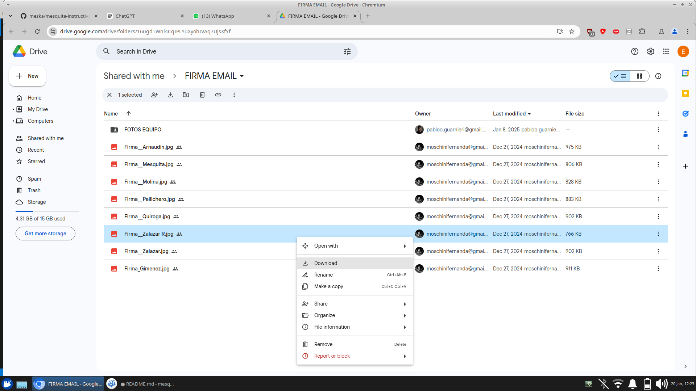
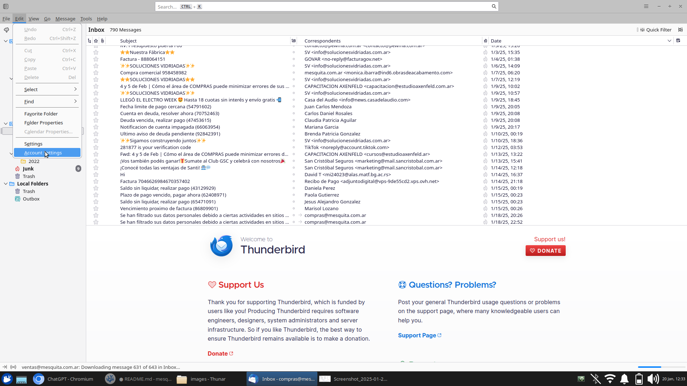
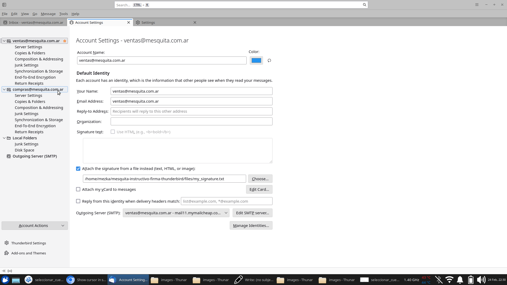
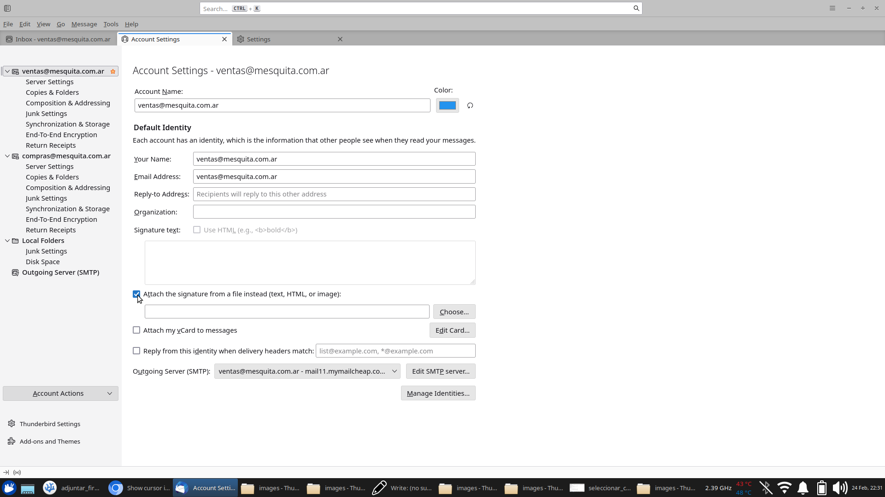
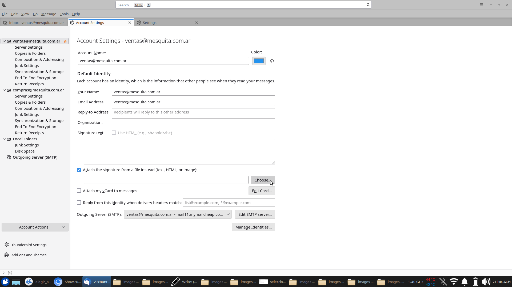
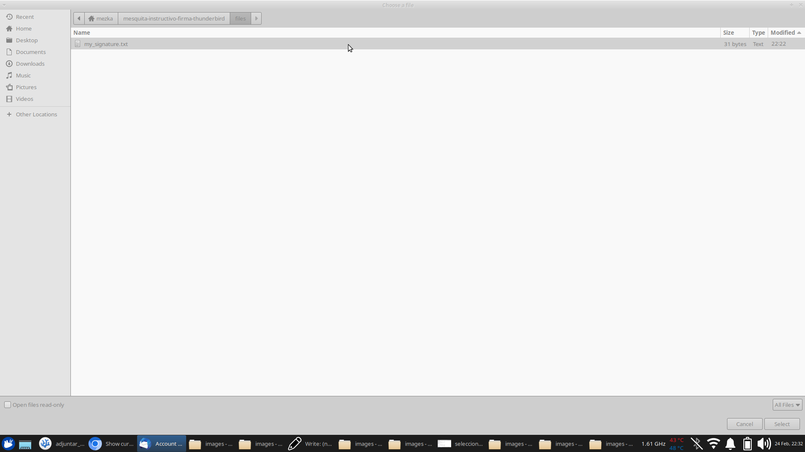
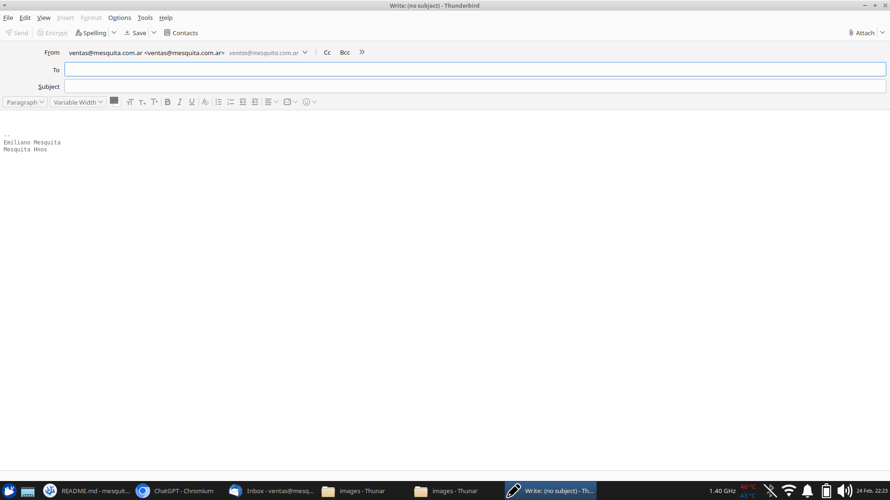

# INSTRUCTIVO PARA CONFIGURAR LA FIRMA EN MOZILLA THUNDERBIRD

1. Descargar el archivo de la firma

2. En el menu superior, ir a editar, configuración de cuenta.

3. Seleccionar la cuenta para la que se quiere utilizar la firma

4. Click en adjuntar firma desde archivo

5. Click en Elegir

6. Elegir el adjunto en el explorador de archivos

7. Firma agregada

